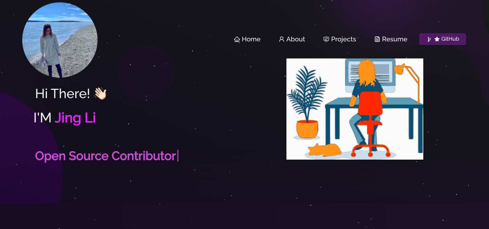
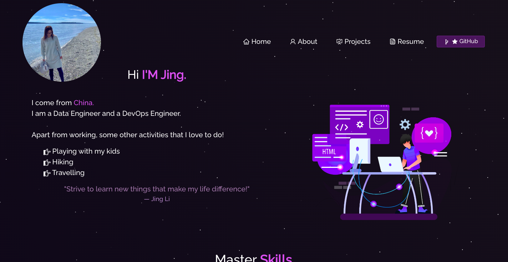

# React-Portfolio
## Table of Contents
- [Description](#description)
- [Installation](#installation)
- [Usage](#usage)
- [Contribution](#contribution)
- [Copyright](#copyright)
- [Link](#link)

## Description:
This is my personal portfolio which features some of my BootCamp projects as well as my resume and technical skills.

## Installation:
- React.js
- Node.js
- Express.js

## Usage:
- Homework

## Contribution:
- N/A

## Copyright:
- Copyright © 2022 Jing Li.
- Licensed under the [MIT License](LICENSE).

## Link:
- GitHub: https://github.com/Jean424/React-Portfolio

- 
- 